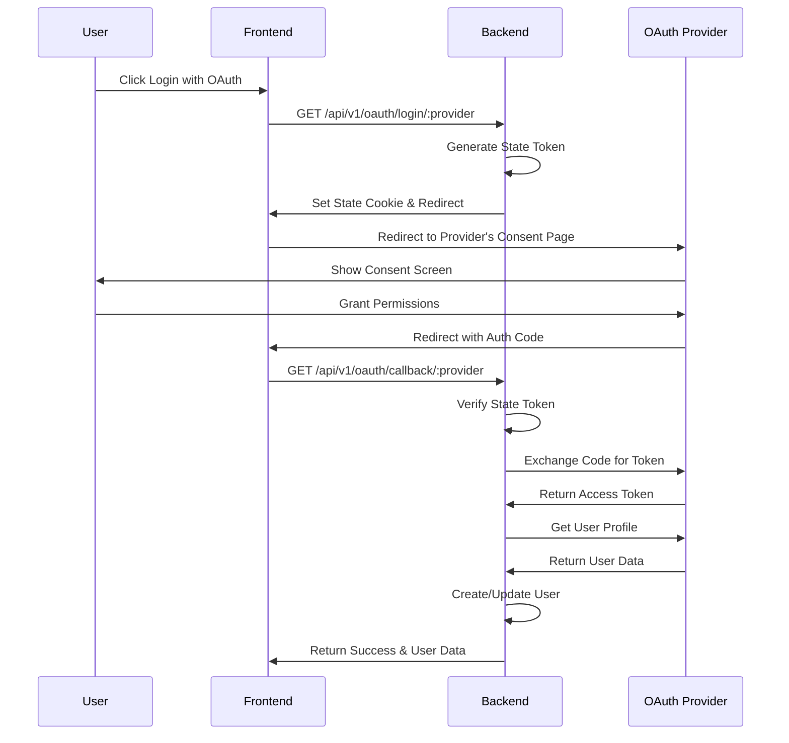
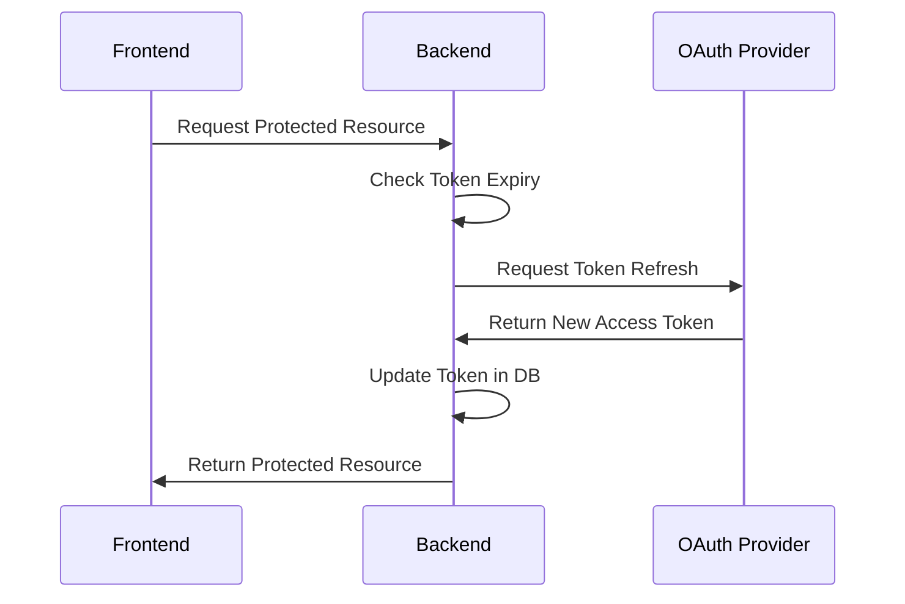
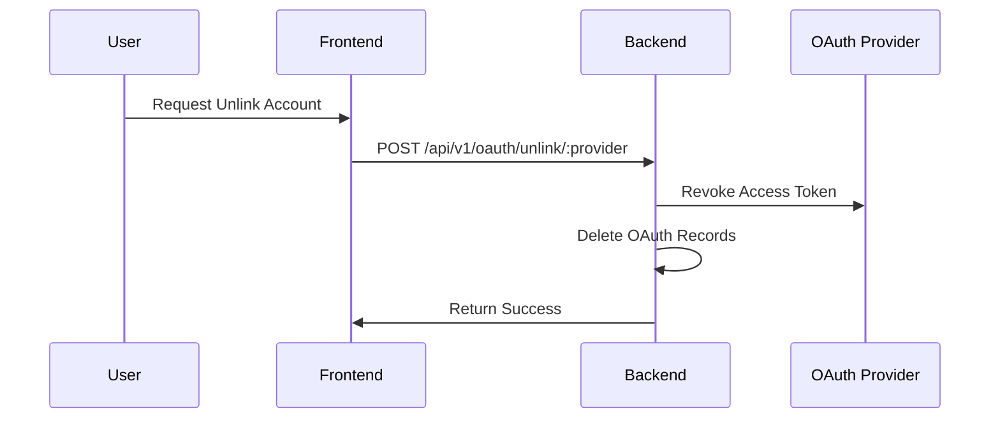
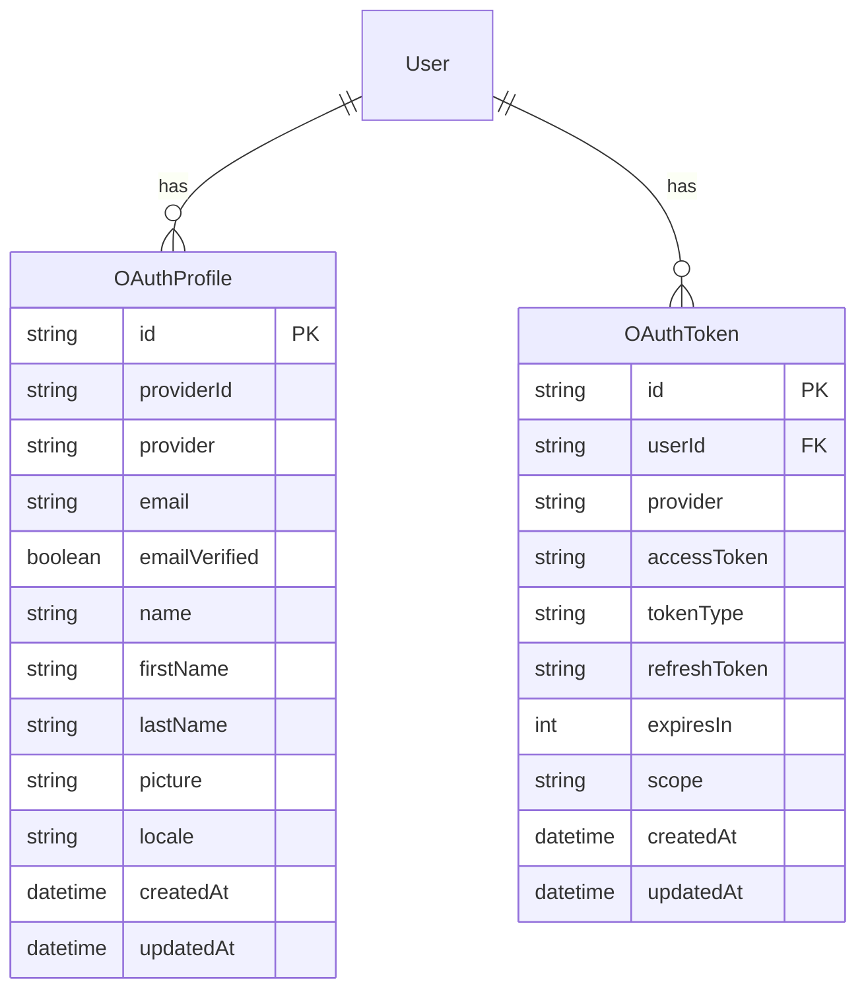
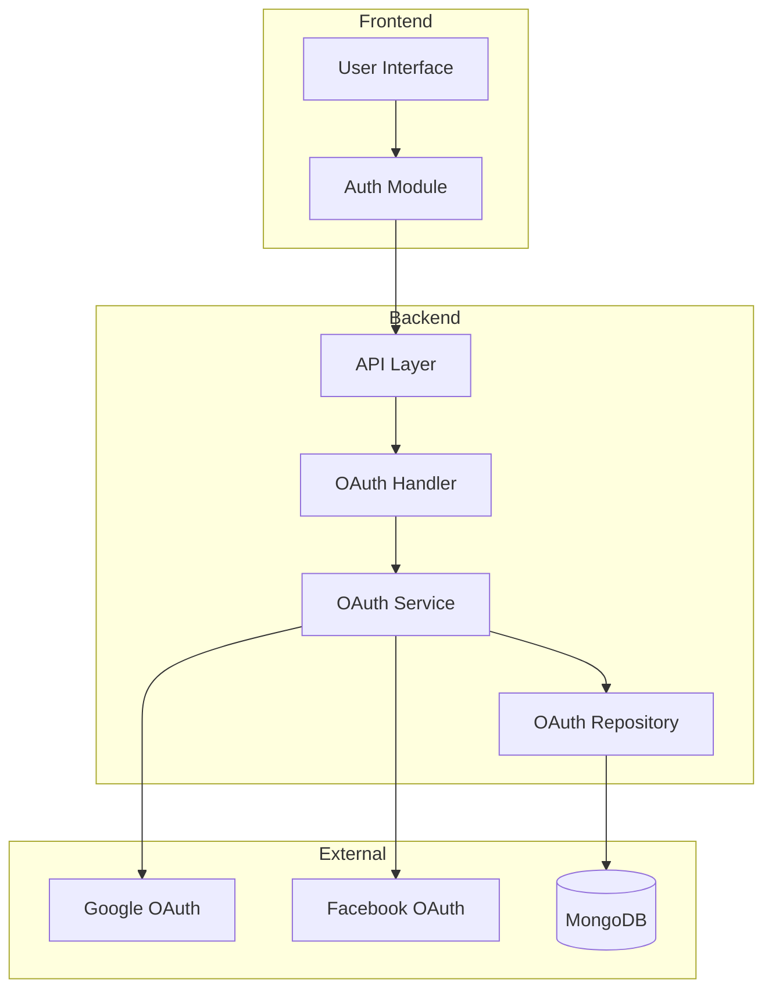

# OAuth Authentication Flow

## 1. OAuth Login Flow



## 2. Token Refresh Flow



## 3. Account Unlinking Flow



## 4. Data Model



## 5. Component Architecture



## Security Considerations

1. **State Parameter**

   - Prevents CSRF attacks
   - Unique per request
   - Short expiration time

2. **Token Storage**

   - Access tokens stored encrypted
   - Refresh tokens with additional encryption
   - Regular token rotation

3. **Error Handling**

   - Failed attempts logging
   - Rate limiting
   - IP-based blocking

4. **Data Protection**
   - HTTPS everywhere
   - Minimal scope requests
   - Data encryption at rest

## Implementation Checklist

- [x] Basic OAuth Flow
- [x] Token Management
- [x] Profile Management
- [x] Error Handling
- [x] Security Measures
- [ ] Rate Limiting
- [ ] Token Rotation
- [ ] Monitoring
- [ ] Analytics

## API Endpoints

### OAuth Login

```http
GET /api/v1/oauth/login/:provider
```

### OAuth Callback

```http
GET /api/v1/oauth/callback/:provider
```

### Unlink Account

```http
POST /api/v1/oauth/unlink/:provider
```

## Environment Variables

```env
# OAuth Configuration - Google
GOOGLE_CLIENT_ID=your_google_client_id
GOOGLE_CLIENT_SECRET=your_google_client_secret
GOOGLE_REDIRECT_URL=http://localhost:8080/api/v1/oauth/callback/google

# OAuth Configuration - Facebook
FACEBOOK_CLIENT_ID=your_facebook_client_id
FACEBOOK_CLIENT_SECRET=your_facebook_client_secret
FACEBOOK_REDIRECT_URL=http://localhost:8080/api/v1/oauth/callback/facebook
```
